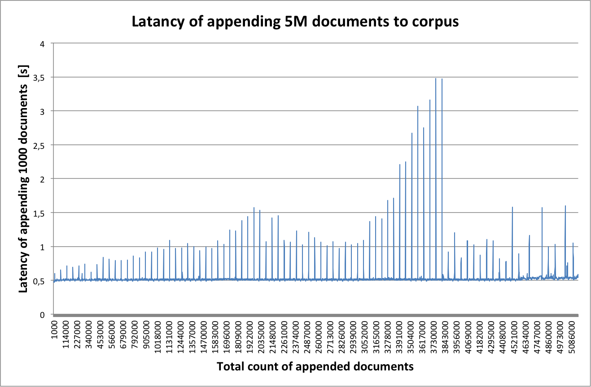
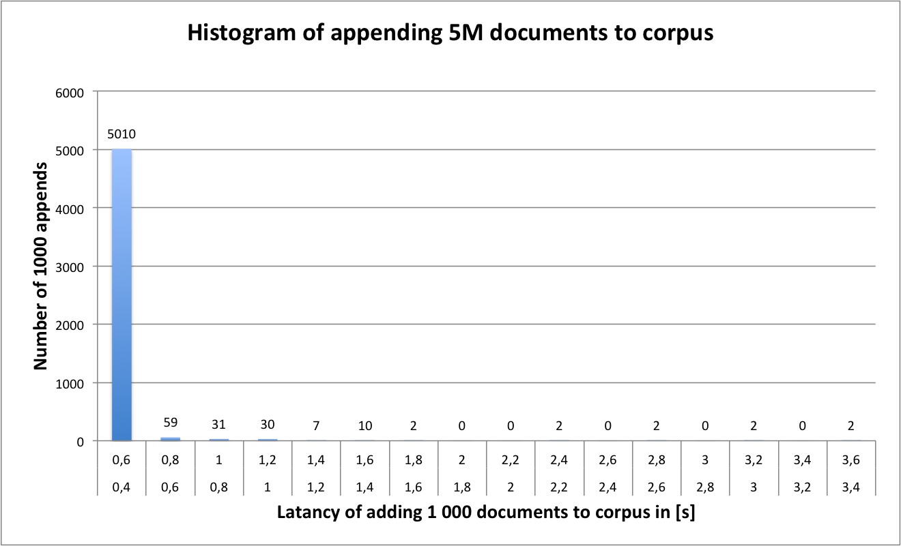

Benchmarks for corpora system
=============================
Corpora was tested for size overhead and latency with building 5M documents corpus. The total size of an initial raw text file was ``2 393 050 900`` Bytes (``2.2`` GB). In the raw text file there where exactly ``5 157 200`` documents, what give an approximate size of one document about ``464`` bytes.

Headers of a document have contained only the ``id`` of the document.

The total size of final corpus was ``2 761 723 865`` Bytes (``2.57`` GB), containing chunks file sized exactly ``2 422 882 196`` Bytes (``2.26`` GB)
and indexes sized exactly ``338 841 600`` Bytes (``323`` MB). 

This gives a total overhead of storing raw text in a corpus about ``15.4%`` and the overhead of storing raw text compared to chunks with headers about ``1.25%``.

Latency of appending every 1000 documents was measured. The test was performed on ``2,8 GHz Intel Core i5``, ``12 GB RAM``, Mac OS X Lion ``10.7.2``  with a HDD drive.

A mean time of appending every 1000 documents was ``0.53s`` with standard deviation about ``0.12s``. On presented graphs latency picks can be observed - possibly caused by  DB Berkley indexes synchronizations to disk.

